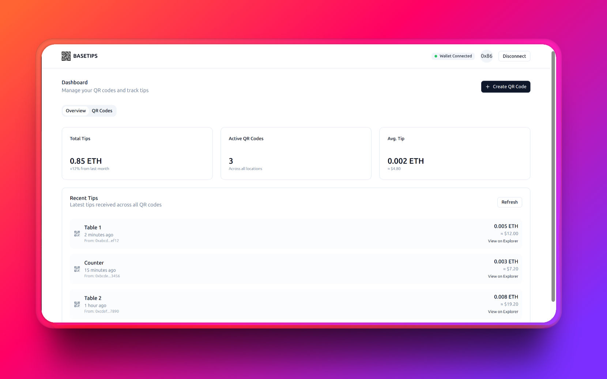
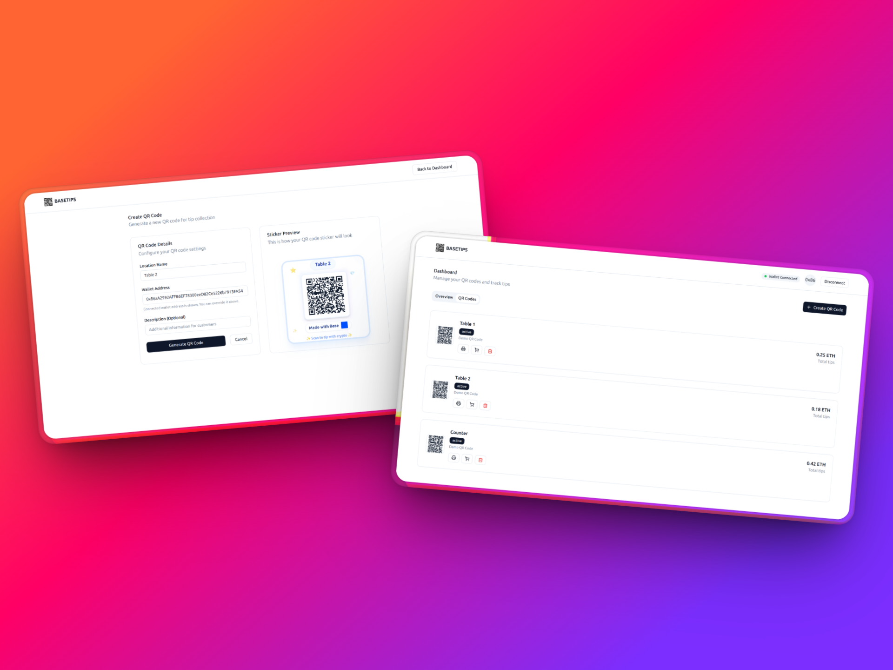

#  BaseTips

[](https://github.com/theakopov/basetips/pulls)
[](https://github.com/theakopov/basetips/actions)
[](https://nodejs.org)
[](https://nextjs.org)
[](https://tailwindcss.com)
[](https://base.org)

**Generate QR Stickers for Crypto Tips**

BaseTips is a modern web application that allows businesses to create custom QR code stickers for receiving cryptocurrency tips. Perfect for restaurants, cafes, bars, and service businesses looking to accept digital payments seamlessly.

<!-- Screenshot of the main dashboard -->


<!-- Screenshot of the QR code creation process -->


## ✨ Features

- 🔗 **Connect Wallet**: Seamlessly connect your crypto wallet using Coinbase's OnChainKit
- 📱 **QR Code Generation**: Create custom QR codes for different locations (tables, counters, etc.)
- 🖨️ **Print Ready Stickers**: Generate printable QR code stickers with your branding
- 📊 **Dashboard Analytics**: Track tips received across all your QR codes
- 💰 **Multi-Currency Support**: Accept tips in various cryptocurrencies on Base network
- 🛒 **Physical Sticker Orders**: Order professional physical stickers for your business
- 📈 **Real-time Updates**: Monitor incoming tips with live transaction tracking


## 🛠️ Tech Stack

- **Frontend**: Next.js 14, React, TypeScript
- **Styling**: Tailwind CSS, shadcn/ui components
- **Blockchain**: Base Network, Wagmi, OnChainKit
- **Wallet Integration**: Coinbase Wallet, MiniKit
- **QR Generation**: Custom QR code generator
- **Notifications**: Real-time transaction notifications

## 🚀 Getting Started

### Prerequisites

- Node.js 18+ installed
- npm or yarn package manager
- A crypto wallet (Coinbase Wallet recommended)

### Installation

1. **Clone the repository**
   ```bash
   git clone https://github.com/yourusername/basetips.git
   cd basetips
   ```

2. **Install dependencies**
   ```bash
   npm install
   # or
   yarn install
   ```

3. **Set up environment variables**
   ```bash
   cp .env.example .env.local
   ```
   
   Fill in your environment variables:
   ```env
   NEXT_PUBLIC_PROJECT_ID=your_project_id
   NEXT_PUBLIC_ENVIRONMENT=development
   ```

4. **Run the development server**
   ```bash
   npm run dev
   # or
   yarn dev
   ```

5. **Open your browser**
   Navigate to [http://localhost:3000](http://localhost:3000)

## 📋 Usage

1. **Connect Your Wallet**: Click "Connect Wallet" to link your crypto wallet
2. **Create QR Codes**: Use the dashboard to generate QR codes for different locations
3. **Print Stickers**: Download or print QR code stickers for physical placement
4. **Track Tips**: Monitor incoming tips in real-time from your dashboard
5. **Order Physical Stickers**: Use the built-in ordering system for professional stickers


## 🔧 Development

## 🤝 Contributing

We welcome contributions! Please feel free to submit a Pull Request.

1. Fork the project
2. Create your feature branch (`git checkout -b feature/AmazingFeature`)
3. Commit your changes (`git commit -m 'Add some AmazingFeature'`)
4. Push to the branch (`git push origin feature/AmazingFeature`)
5. Open a Pull Request

## 🆘 Support

If you have any questions or need help getting started:

- Create an [Issue](https://github.com/theakopov/basetips/issues)
- Check out the [Base Network documentation](https://docs.base.org/)

---

**Made with ❤️ for the crypto community**
